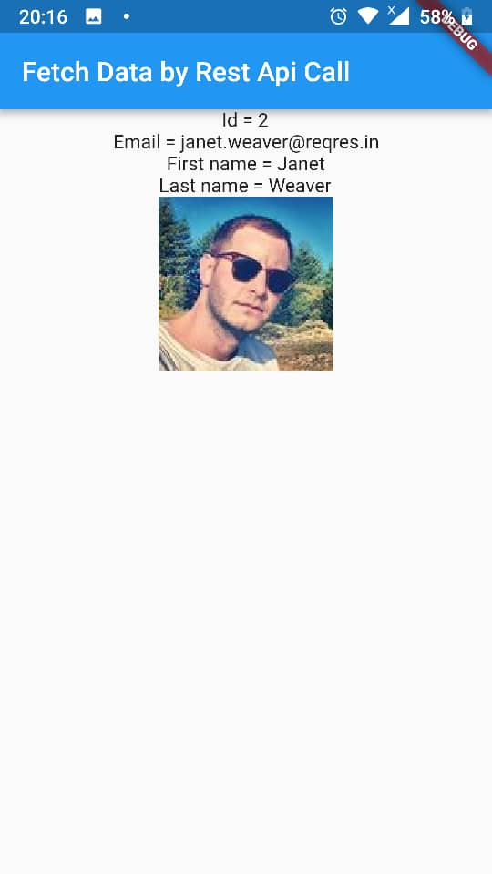

# flutter_app_rest_api

rest api call

## Getting Started

Call rest api from this address (Get method):

https://reqres.in/api/users/2

and show the api call result on screen(
Text information & an image)

## Screenshots:

<b> Android Version: </b>

      

